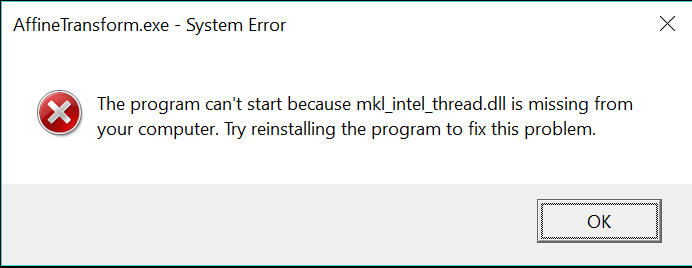

# Homework 3 Affine transformation
Due Monday, November 14, 2016, by 23:59 PM KST

The goals of this homework are to :
- Get some experience with OpenCV and LAPACK(MKL)

Before tackling this homework, you should read related class notes and sample codes.
- [Affine transformation](slides/ec_siip_10.pdf)
- [BLAS and LAPACK](slides/ec_siip_11.pdf)
- [Solving linear systems with MKL](slides/ec_siip_12.pdf)

Please read carefully and follow instructions especially penalty.

## 3-1 Affine warp with OpenCV (2pt)
  - Use given [start codes](https://github.com/CSE6000/Fall2016/tree/master/assignments/homework3/AffineTransform), calculate affine transformation warp matrix with [getAffineTransform()](http://docs.opencv.org/3.1.0/da/d54/group__imgproc__transform.html#ga8f6d378f9f8eebb5cb55cd3ae295a999)
  ```
  warp_mat = //..... //;
  ```
  **NOTE** DO NOT CHANGE NAME OF VARIABLES such as `srcTri`, `dstTri` and `warp_mat`.

  - Apply the Affine Transform just found to the src image with [warpAffine()](http://docs.opencv.org/3.1.0/da/d54/group__imgproc__transform.html#ga0203d9ee5fcd28d40dbc4a1ea4451983)
  ```
  warpAffine(//......//);
  ```
   **NOTE** DO NOT CHANGE NAME OF VARIABLES such as `src`, `warp_dst` and `warp_mat`.

  - Print `srcTri`, `dstTri` and `warp_mat`.
  ```
  cout << "srcTri = " << endl << " " << srcTri[0] << endl << " " << srcTri[1] << endl << " " << srcTri[2] << endl << endl;
  cout << "dstTri = " << endl << " " << dstTri[0] << endl << " " << dstTri[1] << endl << " " << dstTri[2] << endl << endl;
  cout << "warp_mat = " << endl << " " << warp_mat << endl << endl;
  ```
  **NOTE** DO NOT CHANGE CODES ABOVE

## 3-2 Affine warp with LAPACK (3pt)
  - Use LAPACK(Intel MKL), find affine warp that is same as result of OpenCV. It is 3 x 3 matrix and has [0 0 1] row vector.

  ```
  mkl_warp_mat =
  [a_1, b_1, t_1;
  a_2, b_2, t_2;
    0,   0,   1]
  ```
  - Print `mkl_warp_mat`.

  ```
  cout << "mkl_warp_mat = " << endl << " " << mkl_warp_mat << endl << endl;
  ```
   **NOTE** DO NOT CHANGE CODES ABOVE

## 3-3 Result (1pt)
  - Run it again to make result file.

  ```
  $ AffineTransform.exe > output.txt
  ```
  - Move `output.txt` to `/assignments/homework3/output.txt`.

  **NOTE** Make sure the image file(`HappyFish.jpg`) must be in same directory with execution file.

  - if you see error message like below, add MKL redistributable path (`C:\Program Files (x86)\IntelSWTools\compilers_and_libraries_2017.1.143\windows\redist\intel64\mkl` or `%ICPP_COMPILER17%redist\intel64\mkl`) to `%PATH%` environment variable.
  

## 3-4 Submission (1pt)
  - At the end you should have the following files committed to your repository:
    * `/assignments/homework3/output.txt`
    * `/assignments/homework3/AffineTransformation/AffineTransform.sln`
    * `/assignments/homework3/AffineTransformation/AffineTransform/AffineTransform.cpp`
    * `/assignments/homework3/AffineTransformation/AffineTransform/AffineTransform.vcxproj`
    * `/assignments/homework3/AffineTransformation/AffineTransform/AffineTransform.vcxproj.filters`
    * `/assignments/homework3/AffineTransformation/AffineTransform/HappyFish.jpg`

  **NOTE** Do not add other files such as `AffineTransform.exe`, which are created when the c code was compiled. Penalty will be -0.1 * number of files which are unnecessary.

  **NOTE** You should follow the file path listed above. Penalty will be 0.5 * points of (3-1 and 3-2).

## 3-4 Tag your homework (1pt)
  - Tag the commit as 'homework3' that you want graded. If you submit the wrong thing or make further changes to your work before the due date, you can delete old tag and re-tag to new commit.
